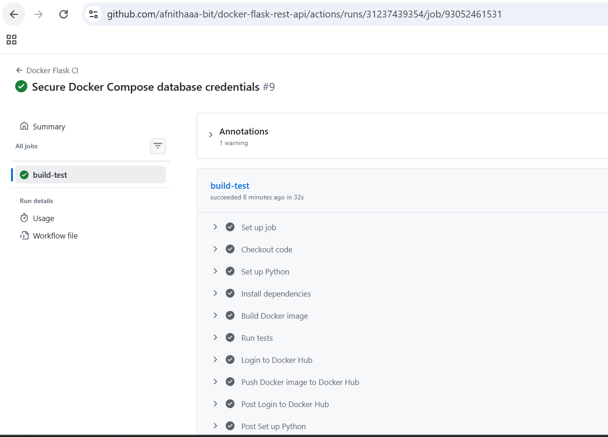
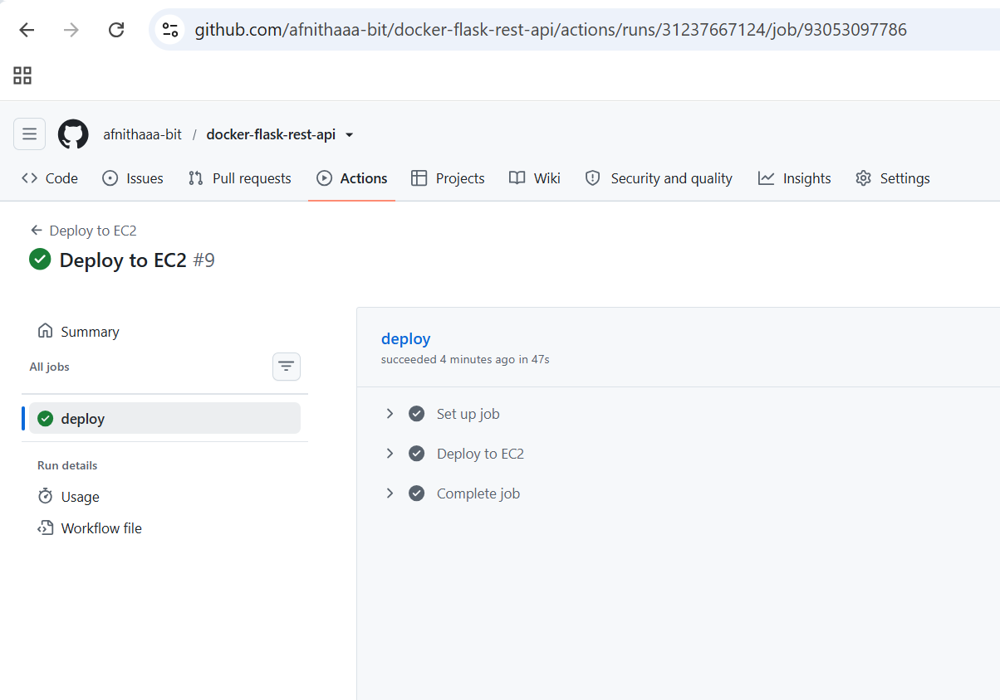
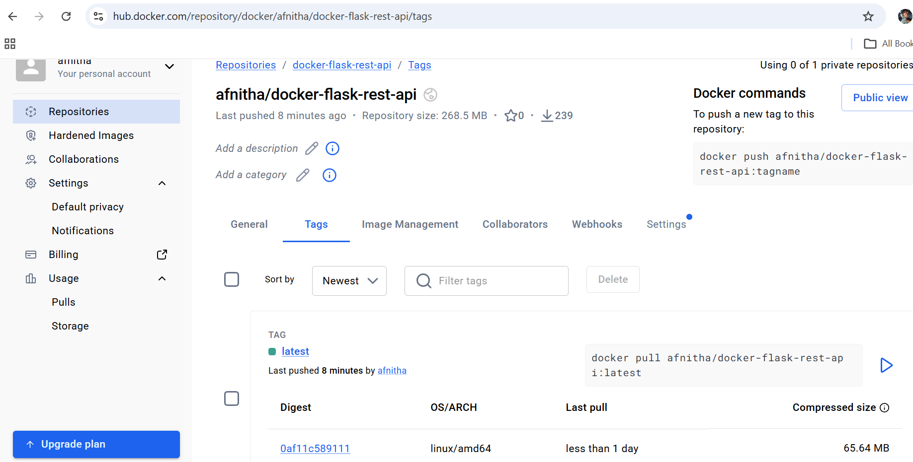
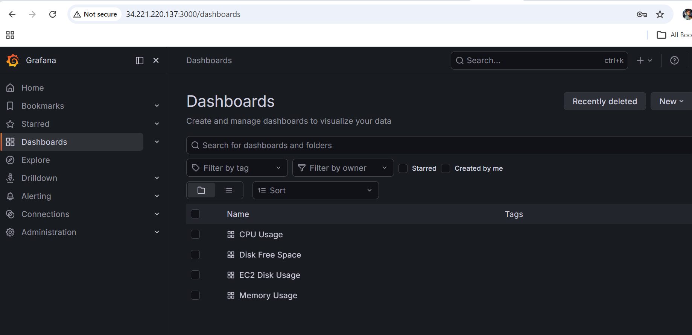

# Docker Flask REST API

A simple Flask REST API that I used to practice Docker, CI/CD, AWS, and basic monitoring.

I built the application, containerized it with Docker, created a CI/CD pipeline with GitHub Actions, published the Docker image to Docker Hub, and deployed the application to an AWS EC2 instance.

## Technologies Used

* Python
* Flask
* Docker
* Docker Compose
* MySQL
* Redis
* AWS EC2
* GitHub Actions
* Docker Hub
* Terraform
* Pytest
* Prometheus
* Grafana

## Project Architecture

```text
                    GitHub Repository
                           |
                           v
                    GitHub Actions
                           |
                  +--------+--------+
                  |                 |
               Run Tests        Docker Build
                                    |
                                    v
                              Docker Hub
                                    |
                                    v
                                AWS EC2
                                    |
                             Docker Compose
                                    |
                +-------------------+-------------------+
                |                   |                   |
                v                   v                   v
          Flask App 1         Flask App 2            MySQL
          Port 5000                                  |
                                                     |
                                                   Redis
```

## Application

The project is a Flask REST API running inside Docker containers.

The application uses:

* Flask for the API
* MySQL for the database
* Redis for caching/service communication
* Docker Compose to run the services together

The Flask application is available on port `5000`.

I tested the application locally and on the EC2 server using:

```bash
curl http://localhost:5000
```

The application returns:

```text
Hello, World!
```

## Docker

The application is packaged using a Dockerfile based on Python 3.11.

Docker Compose is used to run the application and its dependencies.

The main services are:

```text
Flask App 1
Flask App 2
MySQL
Redis
```

Two Flask containers are used so that the project also demonstrates running multiple application containers.

To start the application locally:

```bash
docker compose up -d --build
```

To check the running containers:

```bash
docker ps
```

To stop the services:

```bash
docker compose down
```

## CI/CD Pipeline

I created a GitHub Actions pipeline that runs when code is pushed to the `main` branch or when a pull request is created.

The CI pipeline performs the following steps:

1. Checks out the repository
2. Sets up Python
3. Installs Python dependencies
4. Builds the Docker image
5. Runs pytest inside the Docker container
6. Logs in to Docker Hub
7. Pushes the Docker image to Docker Hub

The project also has a deployment workflow that connects to the EC2 instance and deploys the application.

This helped me understand how automated testing, Docker builds, image publishing, and deployment work together in a CI/CD workflow.

## Automated Testing

I added tests using `pytest`.

The tests are also executed inside the Docker container as part of the GitHub Actions workflow.

Example:

```bash
docker run --rm \
  -e DATABASE_URI=sqlite:///:memory: \
  afnitha/docker-flask-rest-api \
  pytest
```

The GitHub Actions pipeline is configured to fail if the tests fail.

## Docker Hub

The Docker image is published to Docker Hub:

```text
afnitha/docker-flask-rest-api
```

This allows the image to be pulled and deployed on the EC2 server.

## AWS EC2 Deployment

The application is deployed to an Ubuntu AWS EC2 instance.

After deployment, I verified that the containers were running and tested the API directly from the EC2 server:

```bash
docker ps
```

and:

```bash
curl http://localhost:5000
```

Response:

```text
Hello, World!
```

The deployment workflow is managed through GitHub Actions.

## Terraform

Terraform configuration is included in the project for Infrastructure as Code.

The Terraform configuration defines AWS infrastructure such as:

* AWS provider
* EC2 instance
* Security group

This gave me hands-on experience with creating AWS infrastructure using code instead of setting everything up manually.

## Monitoring

I configured Grafana dashboards for monitoring the EC2 environment.

The dashboards include:

* CPU Usage
* Memory Usage
* Disk Free Space
* EC2 Disk Usage

The project also includes configuration for Prometheus, cAdvisor, and Node Exporter as part of the monitoring setup.

Grafana was used to create dashboards for viewing infrastructure metrics.

## Security

Environment-specific credentials are kept outside the Git repository.

The project uses:

```text
.env
.env.example
.gitignore
```

The real `.env` file is ignored by Git.

The `.env.example` file provides example variables without exposing the actual credentials.

GitHub Actions credentials such as Docker Hub credentials are stored using GitHub Secrets.

## Project Structure

```text
docker-flask-rest-api/
│
├── app.py
├── create_db.py
├── drop_db.py
├── Dockerfile
├── docker-compose.yml
├── requirements.txt
│
├── .env.example
├── .gitignore
│
├── tests/
│   └── test_app.py
│
├── screenshots/
│   ├── docker-flask-ci.png
│   ├── docker-flask-deployment.png
│   ├── docker-hub.png
│   └── grafana-dashboard.png
│
├── .github/
│   └── workflows/
│       ├── ci.yml
│       └── deploy.yml
│
└── terraform/
    ├── main.tf
    └── .terraform.lock.hcl
```

## Screenshots

### GitHub Actions CI



The CI workflow successfully runs the automated tests, builds the Docker image, and publishes the image to Docker Hub.

### EC2 Deployment



The GitHub Actions deployment workflow is used to deploy the application to the AWS EC2 instance.

### Docker Hub



The Docker image is published to Docker Hub and can be used for deployment.

### Grafana Monitoring



Grafana dashboards were configured for CPU, memory, and disk monitoring.

## Running the Project Locally

Clone the repository:

```bash
git clone https://github.com/afnithaaa-bit/docker-flask-rest-api.git
```

Move into the project directory:

```bash
cd docker-flask-rest-api
```

Create the environment file using `.env.example` as a reference.

Then start the application:

```bash
docker compose up -d --build
```

Check the containers:

```bash
docker ps
```

Test the API:

```bash
curl http://localhost:5000
```

Expected response:

```text
Hello, World!
```

Stop the application:

```bash
docker compose down
```

## What I Learned

This project gave me practical experience with several DevOps and cloud tools.

I learned how to:

* Build and run a Flask application using Docker
* Use Docker Compose for multiple services
* Work with MySQL and Redis containers
* Write automated tests using pytest
* Create CI/CD workflows using GitHub Actions
* Build and publish Docker images to Docker Hub
* Deploy containers to AWS EC2
* Use Terraform for Infrastructure as Code
* Configure Grafana dashboards
* Work with environment variables and secrets
* Troubleshoot Docker and Linux server issues
* Monitor disk usage and manage limited EC2 resources

## Future Improvements

Some improvements I would like to add in the future include:

* Nginx reverse proxy
* HTTPS with SSL/TLS
* Better application health checks
* Production-grade monitoring
* Centralized logging
* Improved deployment strategy
* Load balancing and high availability

## Author

**Afnitha Nithin Ali**

This project was built as a hands-on Cloud and DevOps learning project.
